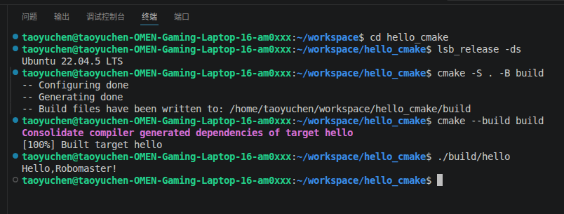

# Hello CMake

## 项目简介
本项目是一个基于Cmake构建的C++ Hello World程序，用于演示Ubuntu环境下C++开发，CMake构建流程。程序运行后将输出“Hello,RoboMaster!"。

## 环境
- Ubuntu 22.04.5 LTS
- CMake 3.22+
- GCC 11+

## 目录结构
```bash
hello_cmake/
├── CMakeLists.txt
├── README.md
├── .gitignore
├── images/
│   └── success.png
└── src/
    └── main.cpp
```

## 构建与运行
```bash
cmake -S . -B build
cmake --build build
./build/hello
```

## 运行结果

关键输出：系统信息，配置，构建，运行命令，[100%] Built target hello，Hello, RoboMaster! 输出。

## 作者与日期
作者：陶宇晨
学号：2255313491
完成日期：2026年9月21日


